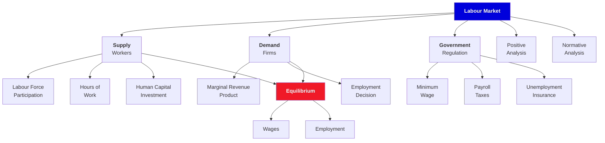

# 1. Introduction to Labor Economics

**Borjas Chapter 1 | 2 lecture hours**

---

## :material-presentation: Presentation

<iframe src="../../slides/ch1-introduction.html" width="100%" height="500" frameborder="0" allowfullscreen></iframe>

---

## :material-sitemap: Concept Map

