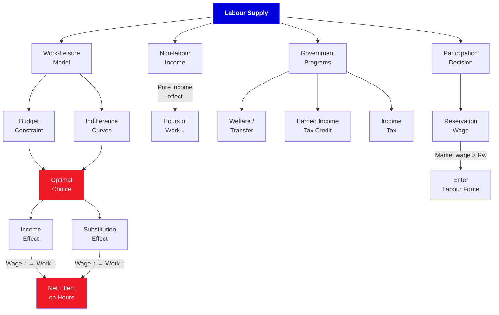

# 2. Labor Supply

**Borjas Chapter 2 | 5 lecture hours**

---

## :material-presentation: Presentation

<iframe src="../../slides/ch2-supply.html" width="100%" height="500" frameborder="0" allowfullscreen></iframe>

---

## :material-sitemap: Concept Map

