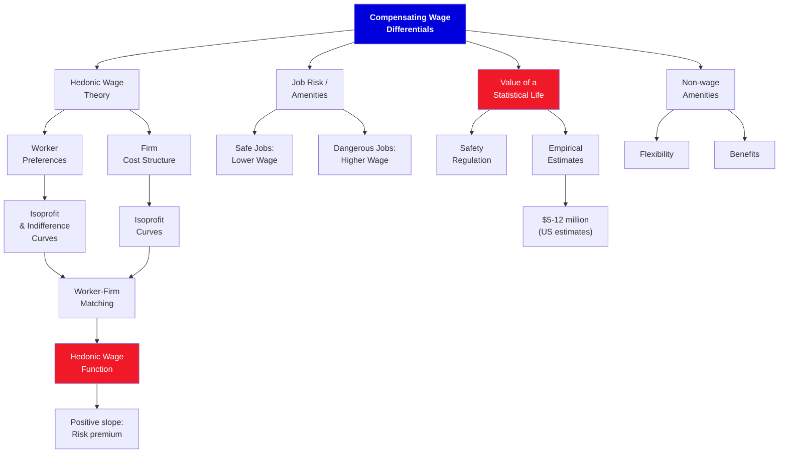

# 5. Compensating Wage Differentials

**Borjas Chapter 5 | 4 lecture hours**

---

## :material-presentation: Presentation

<iframe src="../../slides/ch5-cwd.html" width="100%" height="500" frameborder="0" allowfullscreen></iframe>

---

## :material-sitemap: Concept Map

