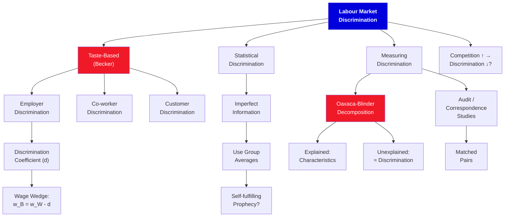

# 9. Labor Market Discrimination

**Borjas Chapter 9 | 4 lecture hours**

---

## :material-presentation: Presentation

<iframe src="../../slides/ch9-discrimination.html" width="100%" height="500" frameborder="0" allowfullscreen></iframe>

---

## :material-sitemap: Concept Map

