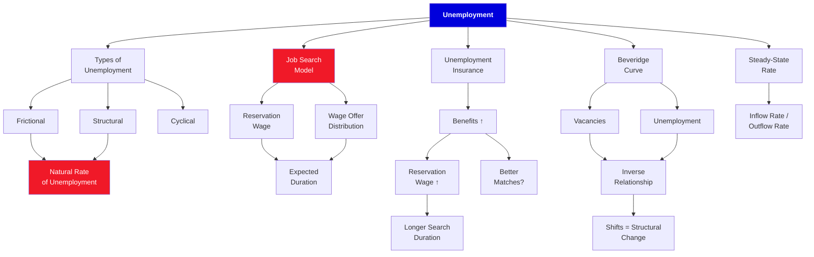

# 12. Unemployment

**Borjas Chapter 12 | 3 lecture hours**

---

## :material-presentation: Presentation

<iframe src="../../slides/ch12-unemployment.html" width="100%" height="500" frameborder="0" allowfullscreen></iframe>

---

## :material-sitemap: Concept Map

